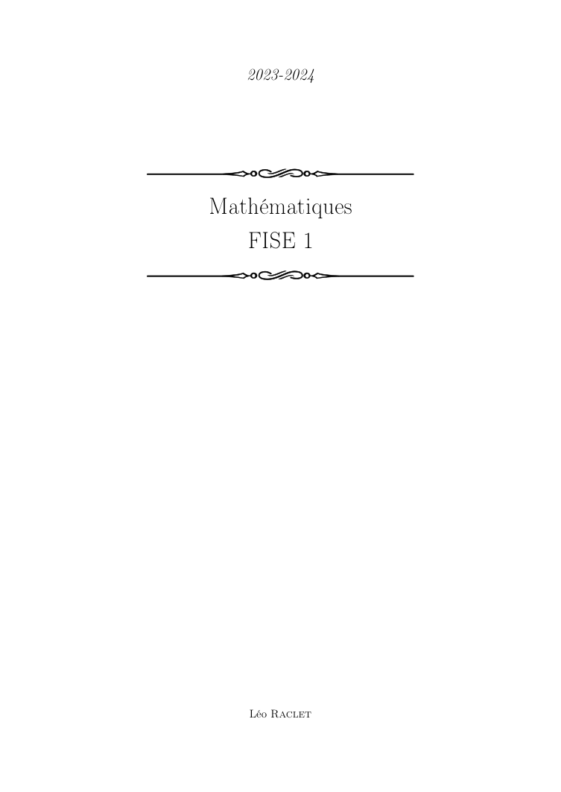
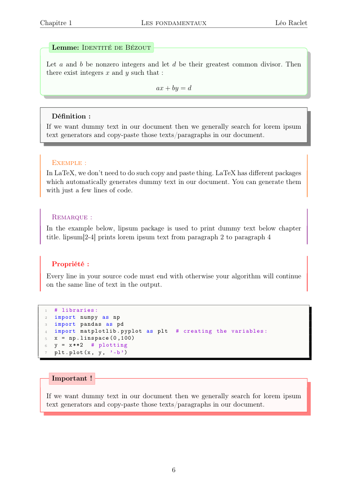
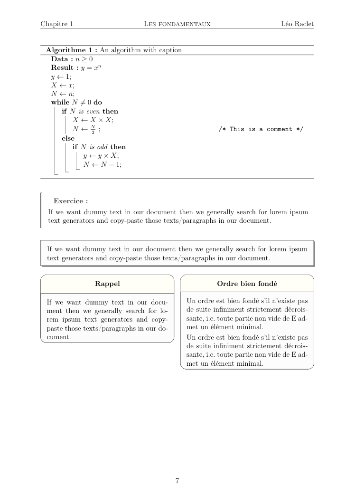
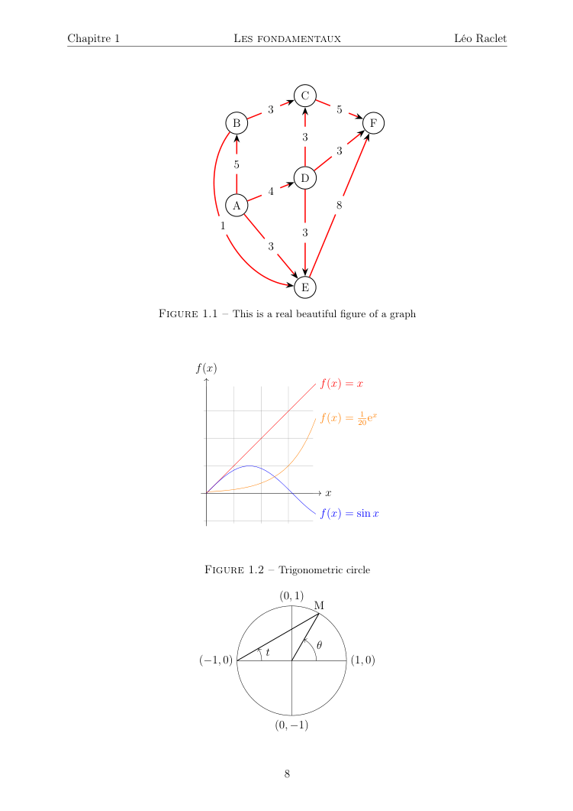
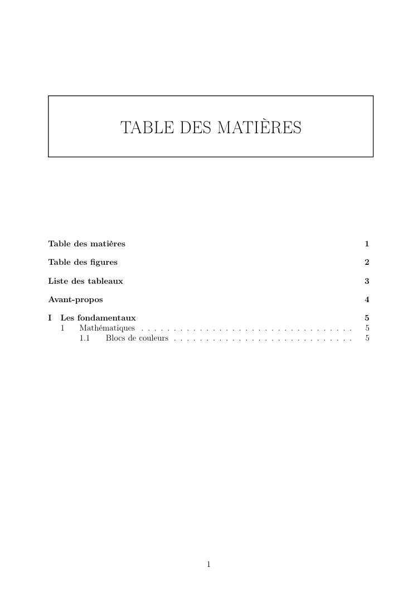

<div align="center"></div>
<h1 align="center">📜 Handsome LaTeX 📜</h1>

<p align="center">
  LaTeX template for your outstanding documents
</p>

<div align="center">


<br>


</div>

## Table of Contents
- [Table of Contents](#table-of-contents)
- [📖 About](#-about)
- [🌟 Showcase](#-showcase)
- [🚀 How to use](#-how-to-use)
  - [Requirements](#requirements)
  - [Usage](#usage)
- [👨‍🔧 Maintainers](#-maintainers)
- [🤝 Contributing](#-contributing)
- [🙏 Credits](#-credits)
- [📜 License](#-license)

## 📖 About

**Handsome LaTeX** is a custom [LaTeX](https://www.latex-project.org/) template that I developed and used throughout my academic years for writing **documents**, **reports**, and **assignments**.

The template includes a range of predefined components and formatting options designed to help you organize your content clearly and present it in a professional, visually appealing way. It’s suitable for both technical and non-technical documents.


## 🌟 Showcase

If you'd like to see the final result, you can view the complete PDF [**here**](./pdf/main.pdf).

> [!NOTE]
> The included **PDF** is a basic demo designed to showcase the different components of the template in various use cases.


|              1               |              2               |
| :--------------------------: | :--------------------------: |
|  |  |
|            **3**             |            **4**             |
|  |  |
|            **5**             |            **6**             |
|  |  |


## 🚀 How to use

### Requirements

A full TeX distribution is assumed for building the PDF. While there are several options available for different operating systems (Windows, macOS, Linux), **TeX Live** is the recommended choice.

You can install TeX Live directly from the official source for the most up-to-date version. Alternatively, on Debian-based systems, you can use:

```bash
sudo apt-get install texlive-full
```

> [!NOTE]
>
> The package from apt is often a few versions behind the latest release.

If you'd prefer not to install the dependencies directly on your system, you can also use [**Docker**](https://docker.com/) as an alternative environment to build the project.

### Usage

To get started with this template, simply copy the [**`preamble.tex`**](./preamble.tex) file into your project.
You can then use it by following the structure shown in the example [**`main.tex`**](./demo/main.tex) file.

To generate the output PDF, make sure you have [**LaTeX**](https://www.latex-project.org/get/) ([see here](#requirements)) installed on your system, and that the `latexmk` command is available in your terminal.

Once that's set up, simply run:

```bash
latexmk {YOUR_DOCUMENT}.tex -pdf
```

> [!IMPORTANT]
>
> For this command to work correctly, both `preamble.tex` and `main.tex` must be located in the same directory.

Or, you can just clone this repo

```bash
git clone https://github.io/leoraclet/handsome-latex
cd handsome-latex
```

And then just use the [**`Makefile`**](./Makefile) like this

```bash
make
```

## 👨‍🔧 Maintainers

> [!WARNING]
>
> I'm currently happy with the way the template is set up, so I don't plan to make any changes in the near future.


This project is maintained by:

- [**N£utr0nys**](https://github.com/leoraclet) — Creator and primary maintainer

For questions or suggestions, feel free to open an issue or reach out directly.

## 🤝 Contributing

Contributions are welcome and appreciated! If you'd like to improve the template, fix issues, or suggest new features, feel free to open a pull request or create an issue.

Before contributing, please:

- Make sure your changes are well-documented and tested.
- Follow the style and structure used in the existing files.
- Keep the code and comments clear and concise.

Your contributions help make this project better for everyone !

## 🙏 Credits

- **LaTeX** – A powerful document preparation system widely used in academia, especially in mathematics and computer science fields.

- **Internet Forums** – For the countless small examples, tips, and snippets shared by the community that helped shape this template.


## 📜 License

This project is licensed under the MIT License - see the [LICENSE](LICENSE) file for details.